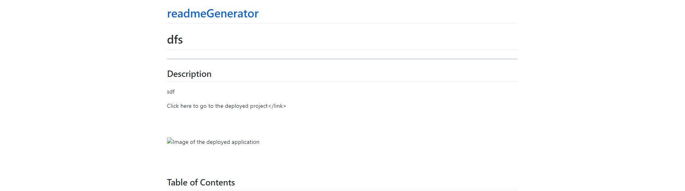

# ReadMe Generator
---
## Description
To create a list of questions that enable quick and efficient generation of a ReadMe with the results of the questions.

<link href="https://courtbourt12.github.io/readmeGenerator/">Click here to go to the deployed project</link>

 
 

 
 

## Table of Contents
    - Installation
    - Usage
    - License
    - Contributing
    - Tests
    - Questions

## Installation
You must download the code from my GitHub repository to be able to use this program.

## Usage
Once you download the program, you must install the inquirer package, and then you can generate a Readme by typing in your terminal "node index.html"

## License
license used : MIT License

 <a href="">Click here for license info.</a>

## Contributing
Courtney Long

## Tests

No tests created for this program.

 

--- 

 

## Questions

If you have any questions, feel free to contact me:
<ul>
<li> Github : <a href="https://github.com/courtbourt">Click here to go to my GitHub page.</a> </li>
<li> Email : courtneylong877@gmail.com </li>
</ul>
