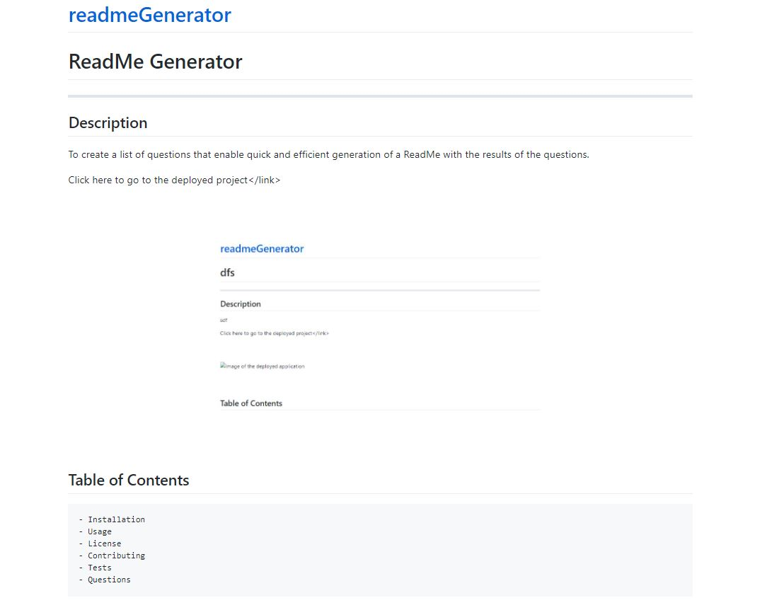

# ReadMe Generator
---
## Description
This program prompts the user to answer questions about their project in order to fill in a ReadMe.md file.

<a href="https://courtbourt12.github.io/readmeGenerator/">Click here to go to the deployed project</a>

 
 

 
 

## Table of Contents
    - Installation
    - Usage
    - License
    - Contributing
    - Tests
    - Questions

## Installation
Go to my GitHub account, clone my repository into your own computer, and then access it via your computer files.

## Usage
You must first install inquirer files by typing "npm i" into the terminal.  Then you must navigate the terminal into the folder that has the index.js file, and type in "node index.js". To see a video of how to use the program, follow this link https://watch.screencastify.com/v/ddCvoFKbdfYAzQeSRR8O.

## License
license used : MIT License

 

<a href="https://opensource.org/licenses/MIT">Click here for license info.</a>

## Contributing
Courtney Long

## Tests

No tests installed.

 

--- 

 

## Questions

If you have any questions, feel free to contact me:
<ul>
<li> Github : <a href="https://github.com/courtbourt12">Click here to go to my GitHub page.</a> </li>
<li> Email : courtneylong877@gmail.com </li>
</ul>
